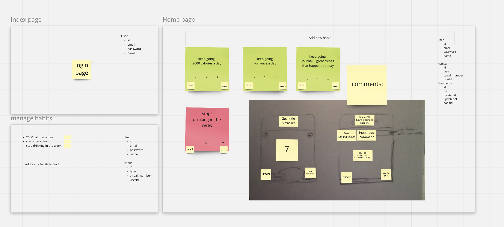
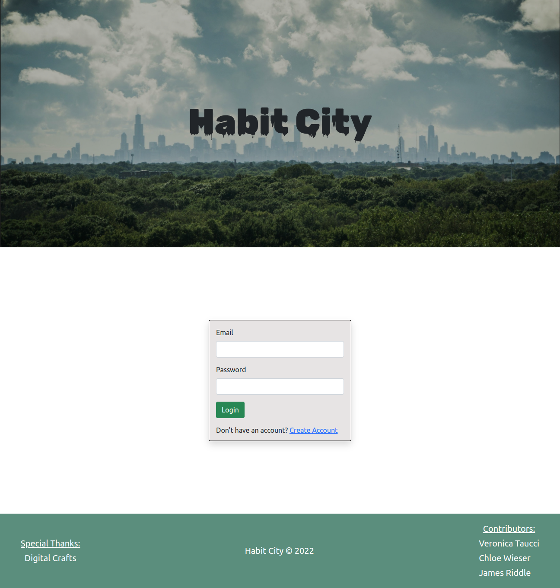
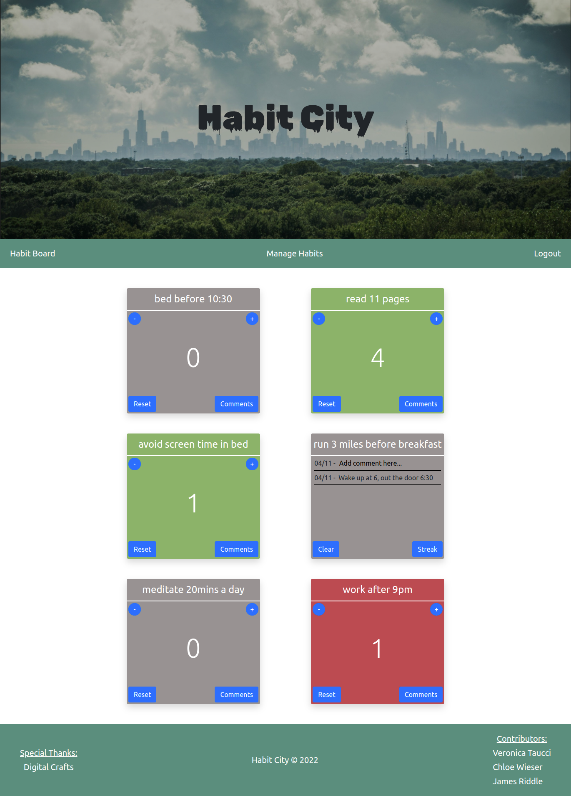
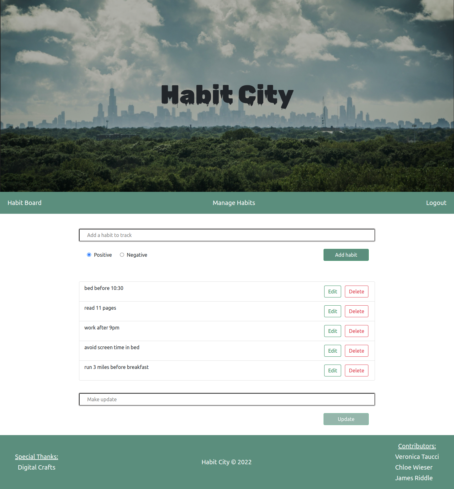

# FullStackProject

## Habit tracker that helps you build good habits and routines

 
 

### Tech Stack

- Node JS
- JavaScript
- HTML
- CSS 
- PostgreSQL

- CSS FlexBox
- Bootstrap
- Sequelize
- Express
- Passport

 
 

### MVP

- Authentication
- Data specific to registered users
- Home Page: Display habits, track streaks and add comments for each habit
- Manage Habits page: Add, display, delete and edit habits
- All user data saved effectively in SQL database
- Use local storage for caching purposes
- Responsive display

## Storyboard

 
 

## Authentication

 
 

## Homepage

 
 

## Manage Habits page

 
 

## Developer Team

- James Riddle - [GitHub](https://github.com/jamescr757/)
- Veronica Taucci - [GitHub](https://github.com/veronicataucci/)
- Chloe Wieser - [GitHub](https://github.com/chloeWieser/)

